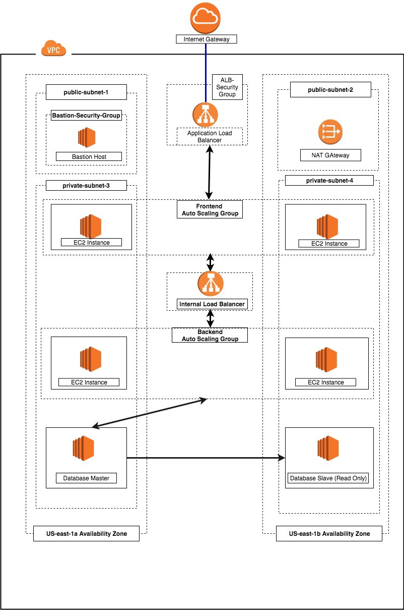

# Three-tier architecture overview

The three-tier architecture is the most popular implementation of a multi-tier architecture and consists of a single presentation tier, logic tier, and data tier. The following illustration shows an example of a simple, generic three-tier application. 


Amazon Web Service (AWS) is a cloud platform that provides different cloud computing services to their customers. To view a list of all AWS services and products, click on this link. In this article, we shall be making use of the following AWS services to design and build a three-tier cloud infrastructure: Elastic Compute Cloud (EC2), Auto Scaling Group, Virtual Private Cloud(VPC), Elastic Load Balancer (ELB), Security Groups and the Internet Gateway. Our infrastructure will be designed to be highly available and fault tolerant.

## Picture



## Screenshots


## Badges

Add badges from somewhere like: [shields.io](https://shields.io/)

[](https://choosealicense.com/licenses/mit/)
[](https://opensource.org/licenses/)
[](http://www.gnu.org/licenses/agpl-3.0)


```
    